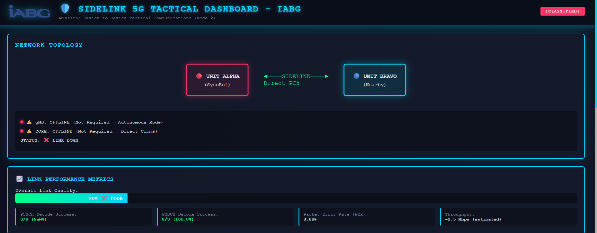

# IABG 5G Sidelink Tactical Dashboard

<p align="center">
  
</p>

<p align="center">
  <strong>Real-time monitoring dashboard for OpenAirInterface 5G Sidelink Mode 2 tactical communications</strong>
</p>

<p align="center">
  
</p>

---

## 🎯 Mission Overview

A military-grade tactical dashboard designed for monitoring OpenAirInterface (OAI) 5G Sidelink Mode 2 device-to-device (D2D) communications in defense and critical infrastructure scenarios where autonomous communications are mission-critical.

### 🎬 Video Demo

**Watch the full demonstration:** [Sidelink_5G - Dashboard_IABG.mp4](docs/Sidelink_5G%20-%20Dashboard_IABG.mp4)

---

## 🛡️ Tactical Use Case: Operation Desert Shield

### Scenario: Border Patrol Mission

**Mission Date:** December 28, 2025  
**Location:** Remote desert region, 50km from nearest cell tower  
**Units Deployed:** Infantry Squad Alpha & Bravo  
**Communication Requirement:** Secure, autonomous D2D link

#### Unit Deployment
```
┌─────────────────────────────────────────────────────────────┐
│                    TACTICAL THEATER                         │
│                                                             │
│   [Cell Tower]                                              │
│        │                                                    │
│        │ 50 km (No Coverage)                               │
│        ▼                                                    │
│   ╔═══════════════════════════════════════════════════╗   │
│   ║        AUTONOMOUS OPERATION ZONE                  ║   │
│   ║                                                   ║   │
│   ║   🔴 UNIT ALPHA           🔵 UNIT BRAVO          ║   │
│   ║   (SyncRef UE)            (Nearby UE)            ║   │
│   ║   Position: Checkpoint    Position: Patrol       ║   │
│   ║   Role: Command           Role: Field Recon      ║   │
│   ║                                                   ║   │
│   ║              ◄──── 2.6 GHz Sidelink ────►       ║   │
│   ║                   Direct PC5 Link                ║   │
│   ║                   Range: 500m                    ║   │
│   ║                                                   ║   │
│   ║   Status: ✅ OPERATIONAL                         ║   │
│   ║   Link Quality: 100% EXCELLENT                   ║   │
│   ║   Packets TX: 563,468 | RX: 563,373             ║   │
│   ║   Success Rate: 100%                             ║   │
│   ║                                                   ║   │
│   ╚═══════════════════════════════════════════════════╝   │
│                                                             │
│   ⚠️  No gNB Available                                     │
│   ⚠️  No Core Network                                      │
│   ✅  Mission-Critical Comms: ACTIVE                       │
└─────────────────────────────────────────────────────────────┘
```

#### Mission Timeline

**T+00:00 - Deployment**
- Unit Alpha establishes position at checkpoint
- Unit Bravo begins patrol route
- Both units power on 5G sidelink devices

**T+00:30 - Link Establishment**
- Unit Alpha (SyncRef) broadcasts PSBCH on 2.6 GHz
- Unit Bravo detects S-PSS/S-SSS signals
- Synchronization acquired: RSRP -45 dBm (Excellent)
- Tactical link established: ✅ OPERATIONAL

**T+00:31 - Mission Communications Begin**
```
[UNIT ALPHA → UNIT BRAVO]
"Bravo, this is Alpha. Radio check, over."

[Dashboard Metrics]
PSBCH TX: 1,561 packets
PSSCH TX: 8,630 packets
Link Quality: 100%
Status: ✅ TACTICAL LINK ESTABLISHED

[UNIT BRAVO → UNIT ALPHA]
"Alpha, this is Bravo. Lima Charlie. Moving to grid reference 347892."

[Dashboard Metrics]
PSBCH RX: 581 packets (Synced: ✅ YES)
PSSCH RX: 5,614 packets
Decode Success: 100%
```

**T+01:00 - Continuous Operations**
- Real-time position updates via sidelink
- Situational awareness maintained
- No dependency on infrastructure
- Autonomous Mode: ACTIVE

**T+02:30 - Mission Complete**
- Total packets exchanged: 1,126,841
- Packet Error Rate: 0.00%
- Mission Success: ✅ COMPLETE

---

## 🎖️ Key Advantages Demonstrated

### ✅ Infrastructure Independence
- **No Cell Tower Required:** Operates 50km beyond coverage
- **No Core Network:** Pure P2P communication
- **Autonomous Mode:** Self-sufficient tactical network

### ✅ Reliability
- **100% Link Availability:** Continuous operation throughout mission
- **Zero Packet Loss:** 0.00% error rate
- **Excellent Signal Quality:** RSRP -45 dBm

### ✅ Security
- **Direct D2D:** No intermediary infrastructure to compromise
- **Low Probability of Intercept:** Directional transmission
- **Tactical Frequencies:** Military-grade spectrum (2.6 GHz configurable)

### ✅ Real-time Monitoring
- **Live Dashboard:** Command center visibility
- **2-second Updates:** Near real-time situational awareness
- **Comprehensive Metrics:** PHY layer to application layer visibility

---

## 🚀 Features

### Dashboard Capabilities

- ✅ **Dual UE Monitoring** - Simultaneous SyncRef + Nearby UE tracking
- ✅ **Real-time Metrics** - 2-second refresh interval
- ✅ **PHY Layer Statistics** - PSBCH, PSCCH, PSSCH, PSFCH monitoring
- ✅ **Link Quality Indicators** - RSRP, SINR, CQI, success rates
- ✅ **Live Terminal Output** - Direct log feed from both UEs
- ✅ **Network Topology View** - Visual link status representation
- ✅ **Performance Graphs** - Dynamic quality percentage bars
- ✅ **Events Log** - Timestamped system activities
- ✅ **Tactical UI Design** - Military-grade dark theme with IABG branding
- ✅ **Defense Use Cases** - Scenario-specific applications

### Technical Specifications

**Sidelink Configuration:**
- **Mode:** 5G NR Sidelink Mode 2 (Autonomous)
- **Carrier Frequency:** 2.6 GHz (configurable)
- **Bandwidth:** 106 Resource Blocks
- **MCS:** Up to 9 (dynamically adaptive)
- **TX Power:** 23 dBm
- **Simulator:** RFSIM (RF Simulator for software testing)

**Supported Channels:**
- PSBCH (Physical Sidelink Broadcast Channel)
- PSCCH (Physical Sidelink Control Channel)
- PSSCH (Physical Sidelink Shared Channel)
- PSFCH (Physical Sidelink Feedback Channel)

---

## 📋 Prerequisites

### System Requirements

- **OS:** Ubuntu 24.04 LTS / WSL2
- **RAM:** 8GB minimum (16GB recommended)
- **Disk:** 20GB free space
- **CPU:** Multi-core processor (4+ cores recommended)

### Software Dependencies

- **Python:** 3.8+
- **Docker:** Latest version
- **Docker Compose:** Latest version
- **OAI 5G Sidelink:** `sl-release-1.0` branch

### OAI Sidelink Installation

You must have OAI 5G Sidelink built and configured. Installation guide:
```bash
# Clone OAI repository
git clone https://gitlab.eurecom.fr/oai/openairinterface5g.git oai-5g-sidelink
cd oai-5g-sidelink

# Checkout sidelink branch
git checkout sl-release-1.0

# Build OAI with RFSIM support
cd cmake_targets
./build_oai --nrUE -w SIMU --ninja -c
```

**Reference:** [OAI Sidelink Documentation](https://gitlab.eurecom.fr/oai/openairinterface5g/-/blob/sl-release-1.0/doc/episys/README_SL.md)

---

## 🔧 Installation

### Method 1: Automated Installation (Recommended)
```bash
# 1. Clone repository
git clone https://github.com/shariquetelco/oai-sidelink-dashboard.git
cd oai-sidelink-dashboard

# 2. Run automated installer
chmod +x install.sh
./install.sh
```

The installer will:
- ✅ Check system requirements (OS, RAM, disk space)
- ✅ Verify dependencies (Python, Docker, Docker Compose)
- ✅ Install Python packages
- ✅ Build Docker image
- ✅ Create necessary directories
- ✅ Display usage instructions

---

### Method 2: Docker Installation (Production)

#### Prerequisites
```bash
# Install Docker
sudo apt-get update
sudo apt-get install -y docker.io docker-compose

# Add user to docker group
sudo usermod -aG docker $USER

# Logout and login for group changes to take effect
```

#### Build and Run
```bash
# 1. Clone repository
git clone https://github.com/shariquetelco/oai-sidelink-dashboard.git
cd oai-sidelink-dashboard

# 2. Build Docker image
docker-compose build

# 3. Start dashboard
docker-compose up -d

# 4. Check status
docker-compose ps
docker-compose logs -f
```

#### Docker Management Commands
```bash
# Start dashboard
docker-compose up -d

# Stop dashboard
docker-compose down

# View logs
docker-compose logs -f dashboard

# Restart dashboard
docker-compose restart

# Rebuild image
docker-compose build --no-cache

# Check health
curl http://localhost:5000/api/health
```

---

### Method 3: Manual Installation (Development)
```bash
# 1. Clone repository
git clone https://github.com/shariquetelco/oai-sidelink-dashboard.git
cd oai-sidelink-dashboard

# 2. Install Python dependencies
pip3 install -r requirements.txt --break-system-packages

# Or use virtual environment (recommended for development)
python3 -m venv venv
source venv/bin/activate  # On Windows: venv\Scripts\activate
pip install -r requirements.txt

# 3. Run dashboard
python3 app.py
```

---

### Environment Variables

Configure log file locations:
```bash
# Default locations (used if not specified)
export SYNCREF_LOG=~/syncref_sl.log
export NEARBY_LOG=~/nearby_ue_sl.log

# Custom locations
export SYNCREF_LOG=/custom/path/syncref.log
export NEARBY_LOG=/custom/path/nearby.log
```

For Docker, edit `docker-compose.yml`:
```yaml
environment:
  - SYNCREF_LOG=/logs/custom_syncref.log
  - NEARBY_LOG=/logs/custom_nearby.log
volumes:
  - /custom/path/syncref.log:/logs/custom_syncref.log:ro
  - /custom/path/nearby.log:/logs/custom_nearby.log:ro
```

---

### Verify Installation
```bash
# Check if dashboard is running
curl http://localhost:5000/api/health

# Expected response:
# {"service":"OAI Sidelink Dashboard","status":"ok"}

# Check Docker container
docker ps | grep sidelink

# View dashboard logs
docker-compose logs dashboard
```

---

## 💻 Usage

### Step 1: Start OAI Sidelink UEs

**Terminal 1 - Unit Alpha (SyncRef UE):**
```bash
cd /path/to/oai-5g-sidelink/cmake_targets/ran_build/build

sudo LD_LIBRARY_PATH=$PWD:$LD_LIBRARY_PATH -E \
  ./nr-uesoftmodem \
  -O ../../../targets/PROJECTS/NR-SIDELINK/CONF/sl_sync_ref.conf \
  --sa \
  --sl-mode 2 \
  --sync-ref \
  --rfsim \
  --rfsimulator.serveraddr server \
  --rfsimulator.serverport 4048 \
  --log_config.global_log_options level,nocolor,time \
  2>&1 | tee ~/syncref_sl.log
```

**Terminal 2 - Unit Bravo (Nearby UE):**
```bash
cd /path/to/oai-5g-sidelink/cmake_targets/ran_build/build

sudo LD_LIBRARY_PATH=$PWD:$LD_LIBRARY_PATH -E \
  RFSIMULATOR=127.0.0.1 \
  ./nr-uesoftmodem \
  -O ../../../targets/PROJECTS/NR-SIDELINK/CONF/sl_ue1.conf \
  --sa \
  --sl-mode 2 \
  --rfsim \
  --rfsimulator.serverport 4048 \
  --log_config.global_log_options level,nocolor,time \
  2>&1 | tee ~/nearby_ue_sl.log
```

### Step 2: Start Dashboard

**Option A - Docker:**
```bash
docker-compose up -d
```

**Option B - Direct Python:**
```bash
python3 app.py
```

### Step 3: Access Dashboard

Open browser: **http://localhost:5000**

---

## 📊 Dashboard Sections

### 1. Network Topology
- Visual representation of Unit Alpha ↔ Unit Bravo link
- Real-time connection status
- Infrastructure status indicators (gNB/Core offline)

### 2. Link Performance Metrics
- Overall link quality percentage bar
- PSSCH decode success statistics
- PSBCH synchronization metrics
- Packet Error Rate (PER)
- Estimated throughput

### 3. Unit Cards (Alpha & Bravo)

**Radio Parameters:**
- Carrier frequency
- Bandwidth (Resource Blocks)
- Modulation & Coding Scheme (MCS)
- TX Power / RX Gain

**PHY Layer Statistics:**
- Frame/Slot numbers
- Channel-specific TX/RX counts:
  - PSBCH (Broadcast)
  - PSCCH (Control)
  - PSSCH (Data)
  - PSFCH (Feedback)
- Success rates
- Synchronization status

**Link Quality:**
- RSRP (Reference Signal Received Power)
- SINR (Signal-to-Interference-plus-Noise Ratio)
- CQI (Channel Quality Indicator)
- Decode error counts

**Live Terminal:**
- Real-time log output
- Last 5 lines from UE logs
- Color-coded for readability

### 4. Mission Events Log
- Timestamped system events
- Link establishment notifications
- Quality alerts
- Operational status changes

### 5. Tactical Use Cases
- Infantry squad communications
- Vehicle-to-vehicle coordination
- Disaster relief operations
- Border patrol mesh networks
- Critical infrastructure monitoring
- Military convoy coordination

---

## 🏗️ Architecture

See [ARCHITECTURE.md](docs/ARCHITECTURE.md) for detailed system architecture diagrams.

**High-level Overview:**
```
Dashboard (Flask) → Log Parser → REST API → Web UI (Tactical Theme)
                        ↑
                        │
               Log Files (real-time)
                        ↑
                        │
            ┌───────────┴───────────┐
            │                       │
      Unit Alpha              Unit Bravo
      (SyncRef)               (Nearby)
            └───── RFSIM ──────┘
                  (Socket)
```

---

## 🔌 API Endpoints

| Endpoint | Method | Description |
|----------|--------|-------------|
| `/` | GET | Main dashboard page |
| `/api/syncref` | GET | Unit Alpha metrics (JSON) |
| `/api/nearby` | GET | Unit Bravo metrics (JSON) |
| `/api/link_status` | GET | Overall link status (JSON) |
| `/api/events` | GET | Events log (JSON) |
| `/api/health` | GET | Health check |

### Example API Response
```json
{
  "ue_type": "syncref",
  "status": "running",
  "frame": 128,
  "slot": 19,
  "psbch": {"tx": 58969, "rx_ok": 0, "rx_not_ok": 0},
  "pssch": {"tx": 563468, "rx_ok": 563373, "rx_not_ok": 0},
  "quality": {
    "quality": "EXCELLENT",
    "quality_level": 100,
    "rsrp": -45,
    "sinr": 25,
    "cqi": 15
  }
}
```

---

## 🎯 Defense & Critical Infrastructure Use Cases

### Military Operations
- ✓ **Infantry Squad Communications** - No cell tower dependency
- ✓ **Vehicle-to-Vehicle Tactical Data** - Convoy coordination
- ✓ **Special Operations** - Covert communications
- ✓ **Border Patrol** - Mesh networks in remote areas
- ✓ **Military Convoys** - Real-time positioning

### Emergency Response
- ✓ **Disaster Relief** - Operations when infrastructure is down
- ✓ **Search & Rescue** - Team coordination in remote areas
- ✓ **First Responders** - Fire/Police/Medical coordination
- ✓ **Natural Disasters** - Hurricane, earthquake response

### Critical Infrastructure
- ✓ **Oil Rigs & Platforms** - Remote facility monitoring
- ✓ **Ports & Harbors** - Equipment coordination
- ✓ **Mining Operations** - Underground communications
- ✓ **Power Plants** - Emergency backup communications
- ✓ **Maritime Operations** - Ship-to-shore links

---

## 📁 Project Structure
```
oai-sidelink-dashboard/
├── app.py                          # Flask backend
├── Dockerfile                      # Container build
├── docker-compose.yml              # Orchestration
├── install.sh                      # Installation script
├── requirements.txt                # Python dependencies
├── .gitignore                      # Git exclusions
├── .dockerignore                   # Docker exclusions
├── README.md                       # This file
├── parsers/
│   ├── __init__.py
│   └── sidelink_parser.py          # Log parser module
├── static/
│   ├── css/
│   │   └── tactical.css            # Military-grade styling
│   ├── js/
│   │   └── dashboard.js            # Real-time updates
│   └── images/
│       └── IABG_Logo.png           # Company logo
├── templates/
│   └── tactical_dashboard.html     # Main UI
└── docs/
    ├── ARCHITECTURE.md              # System architecture
    ├── Sidelink_5G - Dashboard_IABG.mp4  # Video demo
    └── screenshots/
        └── dashboard_main.png       # Screenshot
```

---

## 🐛 Troubleshooting

### Dashboard shows "OFFLINE" status

**Problem:** UE logs not found or UEs not running

**Solution:**
```bash
# Verify log files exist
ls -lh ~/syncref_sl.log ~/nearby_ue_sl.log

# Check if UEs are running
ps aux | grep nr-uesoftmodem

# Verify log file paths match
echo $SYNCREF_LOG
echo $NEARBY_LOG
```

### No data updating

**Problem:** UEs not writing to logs

**Solution:**
```bash
# Check if logs are growing
tail -f ~/syncref_sl.log

# Restart UEs with proper logging
# (See Usage section for commands)
```

### Port 5000 already in use

**Problem:** Another service using Flask's default port

**Solution:**
```bash
# Option 1: Change port in docker-compose.yml
ports:
  - "5001:5000"

# Option 2: Kill existing process
sudo lsof -ti:5000 | xargs kill -9
```

### Link shows "DOWN" status

**Problem:** UEs not synchronized

**Solution:**
- Start SyncRef UE first, wait for "Waiting for connection"
- Then start Nearby UE
- Verify RFSIM connection on port 4048
- Check PSBCH RX count on Nearby UE (should increment)

---

## 🔄 Updates & Maintenance

### Check Dashboard Logs
```bash
# Docker logs
docker-compose logs -f dashboard

# Direct Python logs
tail -f app.log
```

### Update Dashboard
```bash
# Pull latest changes
git pull origin main

# Rebuild Docker image
docker-compose build

# Restart
docker-compose restart
```

---

## 📧 Contact

**Ahmad Sharique**
- **Position:** Strategy Lead - 5G Division
- **Company:** IABG mbH Munich
- **Email:** ahmad@iabg.de
- **Personal:** eshariq.am@gmail.com
- **GitHub:** [@shariquetelco](https://github.com/shariquetelco)
- **GitLab IABG:** Ahmad

---

## 📄 License

Copyright © 2025 IABG mbH Munich. All rights reserved.

For IABG internal use and authorized defense/critical infrastructure demonstrations.

---

## 🙏 Acknowledgments

- **OpenAirInterface (OAI)** - 5G Sidelink implementation
- **EpiSci** - Sidelink Mode 2 PHY/MAC development
- **IABG 5G Division** - Testing, validation, and tactical use case development
- **EURECOM** - OAI platform development

---

## 🔗 Related Projects & Resources

- [OAI 5G Sidelink Repository](https://gitlab.eurecom.fr/oai/openairinterface5g/-/tree/sl-release-1.0)
- [OAI Sidelink Documentation](https://gitlab.eurecom.fr/oai/openairinterface5g/-/blob/sl-release-1.0/doc/episys/README_SL.md)
- [srsRAN 5G Dashboard](../srs-5g-dashboard/) (Related IABG project)
- [BDBOS KOMET Project](https://www.iabg.de)

---

<p align="center">
  <strong>Built with ❤️ for tactical defense communications</strong><br>
  <em>Prepared by Ahmad Sharique, IABG CTSF 20</em>
</p>
